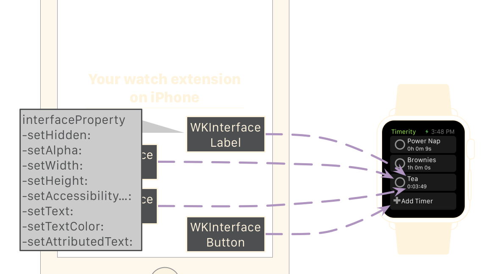
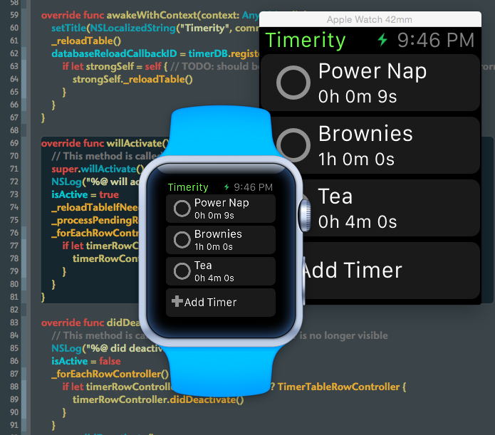

footer: Curt Clifton—The Omni Group. Jan 8, 2015, Seattle Xcoders
slidenumbers: true

^ Sample presenter notes.

^ Are we good?

---

# [fit] Developing with
# [fit] WatchKit 1.0

^ [put this slide up at end of break]

^ [transition to introduce yourself]

---

# Developing with WatchKit 1.0

## Curt Clifton, The Omni Group

### @curtclifton

### curtclifton.net

---

# Outline

- Conceptual model
- Sample app
- Syncing data with Watch
- Debugging Watch apps
- Some challenges
- Other resources
- Wish list

^ [Discuss in terms of your goals for them leaving the talk]

---

# [fit] Conceptual
# [fit] Model

---

## In WatchKit 1.0 your code *runs* in an extension *on the iPhone*.

^ WatchKit extension and Watch app resources are bundled with your iPhone app (like Today and Sharing extensions and custom keyboards)

---

## In WatchKit 1.0 your code *runs* in an extension *on the iPhone*.

^ iPhone first

^ then watch

^ then generated images

^ “So the first thing to remember is that you’re writing code that runs on the iPhone. Almost all assets on the watch are put there statically at install time.”

^ The next piece of the conceptually model is that you have a limited set of classes to work with. In fact…

---

## All the WatchKit classes fit on one slide that you can read.

^ [beat]

---

## All the WatchKit classes fit on one slide that you can read.

^ “but I don’t expect you to.”

^ A couple of interface controllers. You’ll have one for each screen in your watch app.

^ One device class that vends a singleton. Can get device size and cache images with this.

^ All the rest are the classes for building your UI that David talks about.

^ “But what are these classes good for if we can’t run code on the watch?”

---

## All the WKInterfaceObjects are proxies for views on the watch.

---

## All the WKInterfaceObjects are proxies for views on the watch.

 

^ [Quick hand-wavy explanation of the diagram. Details on next slide.]

^ The Apple docs say, “Interface objects are not views. They are proxy objects that communicate wirelessly with the actual views used to implement your UI on Apple Watch.”

^ “So what can you do with these objects? Let’s look at the methods available on WKInterfaceLabel.”

---

## All the WKInterfaceObjects are proxies for views on the watch.

^ setters, not properties!

---

# Conceptual Model

- In WatchKit 1.0 your code *runs* in an extension *on the iPhone*.

- All the WKInterfaceObjects are proxies for views on the watch.

^ summarize

---

# [fit] Sample
# [fit] App

^ [Fire up the WatchApp and give a brief demo of using it. Stay away from the code]

^ Note that the code will be posted on github on Friday

---

# [fit] Syncing 
# [fit] Data with 
# [fit] Watch

^ Next I want to talk about syncing data with Watch…

---

# Your watch extension is a separate process from your iPhone app; you just signed up for data syncing.

^ even if you don't have a "cloud-based" application, almost anything interesting is going to have to share data

^ and even if you do have a cloud app…

---

# Watch apps die easily; network operations are right out.[^1]

[^1]: [Monty Python and the Holy Grail](http://www.imdb.com/title/tt0071853/)

^ So what can we do? …

---

# Cartoon of the Day

^ Before turning to more technical details, it’s probably helpful to understand my state of mind when implementing the code…

---

# Cartoon of the Day[^2]

^ “I first saw this problem on the Google Labs Aptitude Test. A professor and I filled a blackboard without getting anywhere. Have fun.”

[^2]: [https://xkcd.com/356/](https://xkcd.com/356/)

---

# What’s a developer to do?

- File coordination? [Nope.](https://developer.apple.com/library/ios/technotes/tn2408/_index.html)
- [App Group entitlement and user defaults](http://www.atomicbird.com/blog/sharing-with-app-extensions)
- [Shared CoreData database](http://stackoverflow.com/questions/24641768/accessing-core-data-sql-database-in-ios-8-extension-sharing-data-between-app-an)
- Shared SQLite database
- Seed file & callbacks

^ If we can't use network operations, what are our choices?

^ [Review the issues and choices, but don’t dive into code yet.]

---

# [fit] Syncing Using Seed File & Callbacks 

^ note that time flows down the page

^ [talk through the steps chronologically]

^ Let’s take a look at this in code. This should also be a good example of debugging WatchKit apps.

^ [See presenter’s script]

^ [After demo ask if anyone sees an issue: initial watch read has to be coordinated and we could still be killed in the brief window. Possible solution: all callbacks, but would have to wake phone app even to get initial data. Too slow?]

---

# Syncing Data with Watch

- Your watch extension is a separate process from your iPhone app; you just signed up for data syncing.
- Watch apps die easily; network operations are right out.[^1]

^ summarize

---

# [fit] Debugging Watch Apps

- Run iPhone app first
- Open Watch “external display”
- Launch the WatchKit app
- In the simulator, tap the iPhone app
- In Xcode, connect to the iPhone app
- Use Console to watch Simulator’s system log

^ Just a summary of the demo for reference on the steps.

---

# [fit] Challenges

^ I wanted to briefly mention some of the challenges I had implementing the demo app…

---

# Challenges

- Sending UI commands to non-active controls
- Using shared frameworks
- Selecting watch menu items crashes the simulator eventually
- No auto layout?
- Notifications while watch app is running?

^ [If OK on time, show code for first two items.]

^ [If swimming in time, demo coding and running dynamic notification]

^ On the iPhone, if a notification arrives while your app is foregrounded, the system doesn't present the notification, it just calls a method on your app delegate. What's going to happen on the Watch? (There's a method that might be called on the watch, but the docs are unclear and we can't test it.)

---

# [fit] Useful
# [fit] Resources

^ These are some resources I've found handy.

^ Links will be in the slides posted later

^ [Don't read 'em, just click through!]

---

# From Apple

- [Marketing site](http://www.apple.com/watch/)

- [Dev and design resources](http://developer.apple.com/watchkit/)

---

# From Others

- [“A Day with Watch”](http://furbo.org/2014/11/20/a-day-with-apple-watch/)
Craig Hockenberry

- [“As I Learn WatchKit”](http://david-smith.org/watchkit/)
David Smith

- [To-scale Watch Mockup PDF](http://files.iconfactory.net/craig/twitter/Apple_Watch_1-1_v2.pdf)
Thibaut Sailly

---

# Bezel

- [Free from Troy Gaul](http://infinitapps.com/bezel/)

- Combine with [Xscope Mirror](http://furbo.org/2015/01/06/bezel-and-xscope/)

---

# Wish List

- Direct access to the Taptic Engine
- iPhone-free 3rd party code
- API for digital crown
- Animated state changes
- Interactive Glances

^ Ask David to come back up.

---

# [fit]Thanks!

- @curtclifton, [curtclifton.net](http://www.curtclifton.net)
- @davidhoang, [davidhoang.com](http://www.davidhoang.com)

